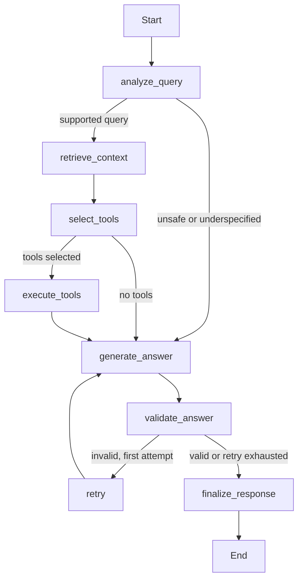

# Architecture

AgentWatch has one FastAPI process, a static React client and SQLite by default. SQLAlchemy stores JSON records in explicit tables for traces, spans, evaluations, tool calls, alerts, feedback, review candidates, experiments, regression runs and drift snapshots. SQLite works without services; `DATABASE_URL=postgresql+psycopg://...` enables PostgreSQL with the optional driver. Schema creation is automatic for a fresh installation; migrations are intentionally deferred.

## Agent state and transitions

State contains the query/category, documents/scores, tool selection/calls/results, answer/citations, validation results/errors, retry count, execution metadata, trace ID, trajectory, security event and fallback flags. Nodes return changed fields to LangGraph. Lists record attempted behavior so final recovery does not erase evidence.

Retrieval confidence below 0.08 routes to the incident tool. Query keywords route to metrics. Mock tools are read-only functions; the system does not execute suggested shell commands. Prompt injection detection refuses a small set of hostile patterns before retrieval or tool execution. Unsupported requests ask for service symptoms and recent changes.

## Tracing and timing

`Recorder.span()` uses monotonic elapsed time and UTC timestamps. It nests embedding/vector search inside retrieval and individual tools inside tool execution. Every span has a random ID, parent ID, input, output summary, error, status, metadata, token estimate and model. The support graph root ends before deterministic evaluation and the sampled judge. Their spans are a separate evaluation phase with `evaluation_latency_ms`; `request_latency_ms` includes both phases. Dashboard agent percentiles intentionally measure the graph, not sampled-judge latency or time waiting for a concurrency slot.

The recorder always writes locally. Optional OpenTelemetry spans are sent with a batch OTLP exporter configured by standard environment variables; transport failure does not remove local records. The public trace ID is also an OTEL attribute for cross-system correlation. Exported attributes intentionally omit raw input/output.

## Concurrency and persistence

An asyncio semaphore bounds active agent executions (default four). A process-local lock serializes benchmark jobs. Tools and local inference use explicit timeouts. SQLite writes use SQLAlchemy sessions; trace, span, evaluation and tool rows commit in one transaction. A single worker is the intended deployment. CPU retrieval and SQLite calls are synchronous and appropriate for this small demo; a scaled deployment should use a job queue and an async data layer.

First startup generates 200 deterministic fixture selections in batches of four, runs real agent execution, and places timestamps across the preceding day. Request IDs and measured timings differ per run. This is synthetic history, not real production traffic. More than 500 spans result because full hierarchical tracing yields roughly 10–15 spans per request. The seed is idempotent once traces exist and reports startup errors in `/health`; interrupted partial seeding should be reset using an explicitly chosen fresh volume.

## Feedback lifecycle

Failures create pending candidates; negative feedback also creates or updates a candidate. Reviewer approval marks a candidate as approved for JSON export. It does not create ground-truth labels or edit the committed golden file. A developer reviews the exported query, provides expected documents/keywords/tools, and submits a dataset PR.

## Alert and drift windows

Dashboard queries are bounded to the newest 1,000 records. Alerts compare the latest 50 with the oldest 50 within that window; drift uses non-overlapping earliest/recent windows. A minimum of ten observations per distribution avoids presenting a score on tiny samples. Alerts are recomputed after requests, throttled to avoid duplicate database work. The store keeps alert state and drift snapshots.

## Deployment boundaries

Compose binds services to loopback. The root cloud image serves static assets from FastAPI on port 7860. API key protection is optional and includes read APIs. It is not a substitute for authentication/authorization in a multi-user deployment. Metrics and health remain unauthenticated for local monitoring. External exporters, embeddings, inference and observability services are optional in demo mode.

