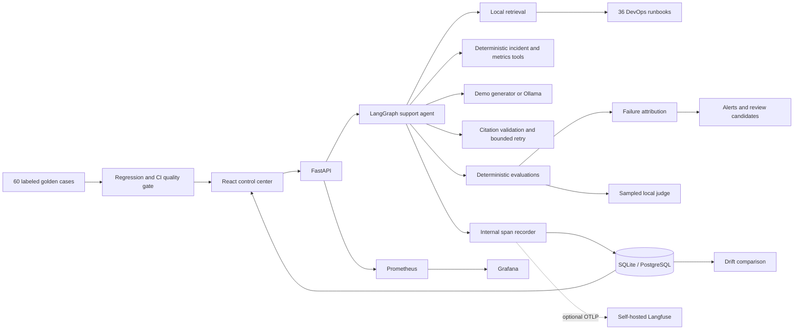

# ◉ AgentWatch

See [Public demo and live answers](docs/PUBLIC-DEMO.md) for request budgets, real Ollama tool selection, evaluator v2 semantics, and the required baseline review after upgrading. This supersedes older demo-judge descriptions below.

### Production AI Evaluation, Monitoring & Reliability Platform

    

**An AI support agent with an evidence trail: trace every decision, evaluate every answer, inject failures, and block regressions before release.**

AgentWatch is a runnable portfolio reference implementation for senior AI engineering interviews. The support agent is deliberately small. The interesting engineering is the reliability platform around it: independent checks, bounded retries, trace attribution, sampled judging, drift signals, human review, and release gates.

## Try it in three commands

Requires Docker Engine/Desktop with Compose v2.24+; no API keys, GPU, model download, or hosted account.

```bash
git clone <your-agentwatch-repository>
cd agentwatch
cp .env.example .env
docker compose up --build
```

On Windows PowerShell, use `Copy-Item .env.example .env`.

Open **http://localhost:3000**. The first startup executes 200 synthetic requests and baseline experiments before becoming healthy (usually 30–120 seconds after the images build). Later startups reuse the SQLite volume. Network access is needed to download build dependencies, not to run demo inference. No paid service is required.

| Surface | Local URL |
|---|---|
| Dashboard | http://localhost:3000 |
| API / OpenAPI UI | http://localhost:8000/docs |
| Health | http://localhost:8000/health |
| Prometheus exposition | http://localhost:8000/metrics |
| Prometheus, optional profile | http://localhost:9090 |
| Grafana, optional profile | http://localhost:3001 |

## A five-minute recruiter demo

1. **Overview:** inspect real seeded traces, quality trends, tail latency and alerts.
2. **Run agent:** ask why Kubernetes reports `CrashLoopBackOff`. Open its waterfall and retrieved runbooks.
3. **Chaos Lab:** inject a tool timeout. Watch a real deadline expire and see `LATENCY_FAILURE`, component attribution and tool failure evidence.
4. Inject a hallucinated citation. See two generation attempts, citation rejection, and a safe final fallback. Final citation accuracy can recover while the attempted failure remains visible.
5. **Drift monitor:** simulate a traffic shift, then inspect which distributions moved.
6. **Experiments:** compare top-k 3 and 5 on the same golden cases.
7. **Regression tests:** run a normal release, then a degraded release. Empty retrieval blocks deployment with concrete reasons.
8. Submit negative feedback and approve a candidate in **Review queue**. Export it for a reviewed dataset change; the golden dataset is never silently rewritten.

The expanded [demo guide](DEMO.md) contains 15 scenarios. [Interview guide](docs/INTERVIEW_GUIDE.md) explains the tradeoffs behind the implementation.

## Architecture



Read [ARCHITECTURE.md](ARCHITECTURE.md) for state, persistence, concurrency and failure behavior; [EVALUATION.md](EVALUATION.md) for metric definitions and limitations.

## What is real, what is simulated?

| Capability | Demo mode | Local model mode |
|---|---|---|
| Agent orchestration | Real LangGraph branching/retry | Same graph |
| Retrieval | Real TF-IDF cosine search | Sentence-transformers + FAISS |
| Generation | Deterministic runbook excerpts | Ollama inference |
| Tools | Deterministic mock operational data | Same intentionally mock tools |
| Traces, timing, SQLite writes | Real | Real |
| Online metrics | Deterministic lexical proxies and exact checks | Same plus sampled local judge |
| Sampled judge | Clearly labeled simulated proxy | Pydantic-validated Ollama JSON |
| Offline semantic metrics | Skipped unless explicitly enabled | Five DeepEval built-in metrics with Ollama |
| Chaos behavior | Real execution modifications | Same modifications |
| Token usage and dollar cost | Character estimates; **SIMULATED COST** | Same estimate; no local API charge |

There is no hidden cloud LLM call. DeepEval installs an OpenAI SDK transitively but no code path here requires an OpenAI key or invokes a paid model. Demo scores demonstrate evaluation plumbing; they do not establish the semantic quality of a general-purpose LLM.

## Features to inspect in the code

- Hierarchical span recording with inputs, output summaries, status, errors, timings, model and token estimates; atomic persistence of trace, spans, evaluations and tool calls.
- Exact citation validity, retrieval precision/recall/hit-rate/MRR when labeled, response structure, tool success/selection, trajectory efficiency/deviation and retry tracking.
- Independent multi-label failure rules covering retrieval, low confidence, tools, redundant calls, hallucination suspicion, prompts, model errors, citations, overflow, safety, latency and unknown failures.
- Twelve isolated chaos scenarios that mutate the execution pipeline.
- Baseline/recent drift in lengths, retrieval, latency, tools, quality and embedding centroid; explicit sample minimum and heuristic interpretation.
- Versioned 60-case golden dataset, explicit baseline creation, absolute and relative release thresholds; deliberately degraded runs prove the gate blocks.
- Reviewer-controlled candidate approval and JSON export, without automatic golden dataset promotion.
- Recharts trends, distributions, trace waterfall, expected/actual trajectory, diagnostic evidence and connection/loading/empty/error states.

## Development without Docker

Use Python 3.12 and Node 24 LTS. From the repository root:

```bash
python -m venv .venv
source .venv/bin/activate  # Windows: .venv\Scripts\Activate.ps1
python -m pip install -e '.[dev]'
cd frontend
npm ci --ignore-scripts
cd ..
python -m uvicorn backend.app.main:app --host 127.0.0.1 --port 8000
```

In a second terminal: `cd frontend && npm run dev`; open http://127.0.0.1:5173. The Vite proxy forwards API requests to port 8000. Stop both with Ctrl+C.

```bash
python -m pytest -q
python scripts/evaluate.py
python scripts/seed_demo_data.py
python -m ruff check backend evals scripts
cd frontend && npm run lint && npm run build
```

`make install`, `make dev`, `make test`, `make eval`, `make seed`, `make docker`, `make lint`, and `make format` wrap these operations. `make dev` starts the backend; start the frontend in a separate terminal.

## Local LLM and semantic evaluation

```bash
python -m pip install -e '.[dev,local]'
ollama pull qwen2.5:3b
```

Set `DEMO_MODE=false`, `SEED_ON_START=false`, `OLLAMA_URL=http://localhost:11434`. The first sentence-transformers run downloads the embedding model. Optional `RERANK=true` downloads a local cross-encoder. These require RAM, disk and initial network access, but no paid inference.

For Compose, set `INSTALL_LOCAL=true` and `DEMO_MODE=false` in `.env`, then `docker compose --profile local-llm up --build -d`. Run `docker compose exec ollama ollama pull qwen2.5:3b` before sending requests. Set `OLLAMA_URL=http://ollama:11434` inside Compose.

```bash
RUN_LOCAL_JUDGE=true python -m pytest evals/test_rag.py -q
```

PowerShell: `$env:RUN_LOCAL_JUDGE='true'; python -m pytest evals/test_rag.py -q`.

The offline adapter passes a JSON schema to Ollama, validates the result and retries once. Semantic evaluations fail explicitly if the local judge is unavailable. Online judging instead records `unavailable` and preserves the deterministic result.

## Observability and deployment

`docker compose --profile observability up --build` adds Prometheus and provisioned Grafana dashboards. Langfuse is optional through standard OTLP/HTTP; see [deployment guide](docs/DEPLOYMENT.md). Internal traces remain available when any exporter is disabled or disconnected.

The root Dockerfile also builds a single-container FastAPI + React application on port 7860 for a lightweight cloud demo. Hugging Face currently documents free CPU Basic resources, with ephemeral disk and sleep behavior; verify eligibility and current terms before deployment. Detailed [deployment instructions](docs/DEPLOYMENT.md) include sources and the verification date. Sites hosting uses a JavaScript Worker runtime and cannot execute this Python backend; publishing only its static frontend would not deliver the requested application.

## CI/CD quality gate

`.github/workflows/evaluation.yml` runs on pull requests and pushes to main: unit/API/chaos tests, credential-free DeepEval custom metrics, a deterministic golden benchmark, regression gate, lint, strict frontend build and Docker smoke checks. Reports are uploaded even on failure. The committed baseline is never recreated by CI.

Default gates: grounding proxy ≥ 0.80, recall ≥ 0.75, citation accuracy ≥ 0.95, P95 ≤ 5,000 ms, and relative metric regression ≤ 10%. Demo benchmark waits are accelerated and must be compared within the same mode. These gates are an example policy, not universal production thresholds.

## Repository map

```text
backend/app/         Graph, retrieval, tools, tracing, metrics, drift, failure rules, API
backend/tests/       Non-LLM unit, integration, API and chaos tests
frontend/app/        React dashboard, typed API client, charts and evidence panels
frontend/components/ui/  Accessible shared UI primitives
data/knowledge_base/ 36 small DevOps runbooks
data/incidents/      20 deterministic historical incidents
data/evaluation/     60 golden cases and committed baseline
evals/               DeepEval custom metric and optional Ollama semantic suite
observability/       Prometheus scrape config and Grafana provisioning
scripts/             Data authoring, seeding, evaluation and Compose checks
docs/                Deployment, limitations and interview guide
```

## Screenshots

The live dashboard is the primary preview. For your GitHub repository, capture Overview, Trace detail, Chaos Lab, and Regression gate after the seed finishes. The slots and suggested captions are documented in [docs/SCREENSHOTS.md](docs/SCREENSHOTS.md); no generated image is presented as a tested application screenshot.

## Scope and next improvements

This is a portfolio reference, not a multi-tenant production service. Add durable background jobs, migrations, trace retention, richer input redaction, SSO/RBAC, rate limiting and a manually curated semantic benchmark before deploying with sensitive data. Exact known limitations and verification results are in [docs/LIMITATIONS.md](docs/LIMITATIONS.md).

For interviews: explain why exact citation accuracy differs from semantic faithfulness, how a recovered final response can conceal an attempted failure, why missing ground truth is `null`, and why demo judge scores must never be presented as model validation.

Licensed under [MIT](LICENSE).

