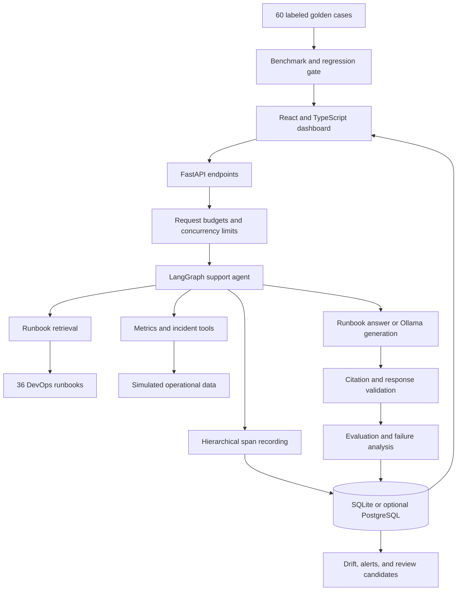
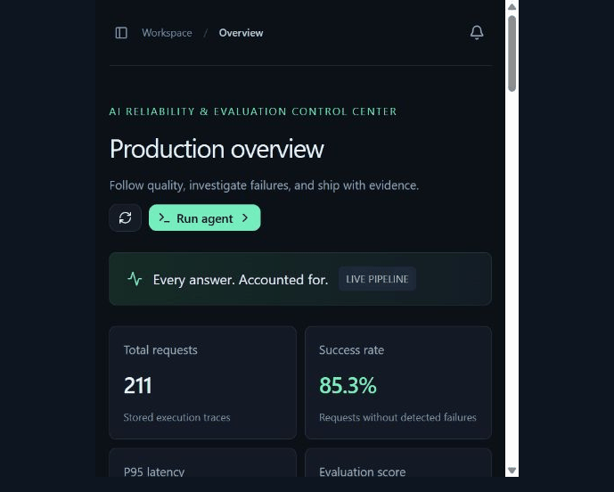
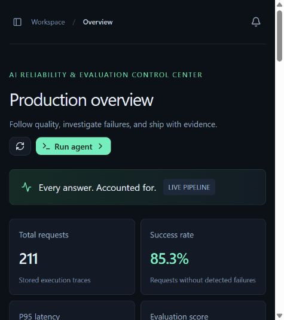
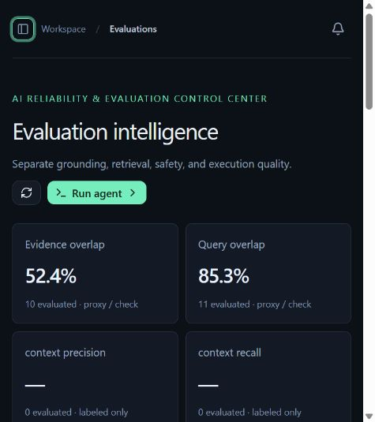
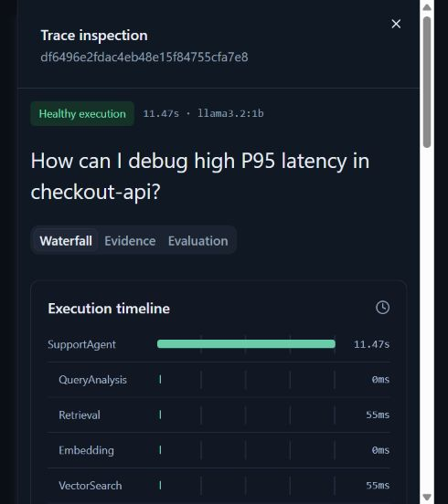
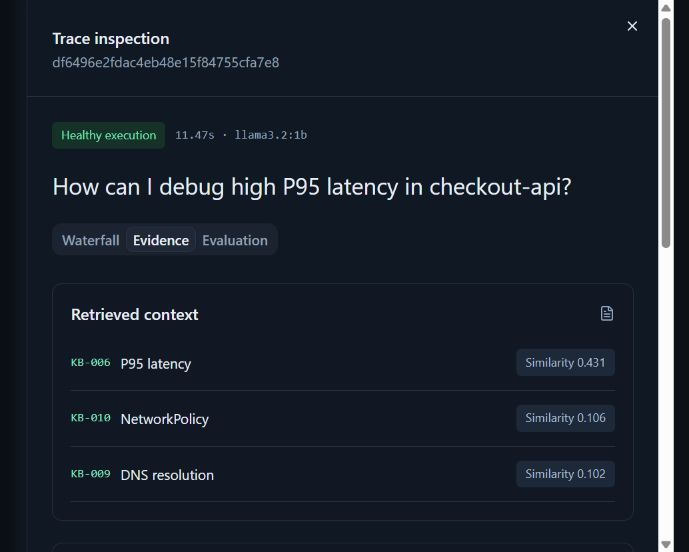
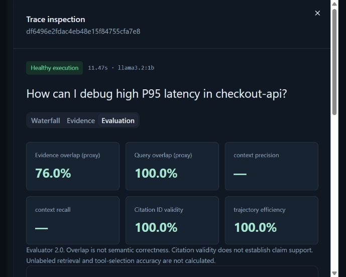

# AgentWatch

**An AI agent observability and evaluation platform for understanding how answers are produced—and where they fail.**


AgentWatch combines a DevOps support agent with a dashboard for tracing, evaluation, failure analysis, chaos testing, drift monitoring, and regression gates. It demonstrates the engineering around an AI application: collecting evidence, measuring execution, testing failures, and deciding whether a change is safe to release.

The project supports a reproducible runbook demo that needs no model or API key, and optional real generation through Ollama. Both use the same tracing and evaluation pipeline. Diagnostic tools use simulated operational data in both modes.

## Why this project exists

An answer alone does not explain whether an agent retrieved the right information, selected a useful tool, fabricated a reference, or spent too long generating a response. A final fallback can also hide an earlier failed attempt.

AgentWatch records the execution behind each answer. You can follow a request from query analysis through retrieval, tools, generation, validation, and evaluation; inspect the supporting evidence; and turn problematic requests into reviewed regression candidates.

This is a portfolio reference implementation with a deliberately small support domain, not a multi-tenant production monitoring service.

## Dashboard features

| Page | What you can inspect or do |
|---|---|
| Overview | Request volume, success rate, latency percentiles, quality trends, estimated tokens, and alerts |
| Traces | Search executions and inspect spans, timings, documents, tool results, answers, and failures |
| Evaluations | Compare proxy scores and exact checks, including sample counts and coverage |
| Drift | Compare baseline and recent traffic and inspect which distributions changed |
| Alerts | Review reliability conditions and their supporting evidence |
| Experiments | Compare retrieval top-k configurations on the same labeled questions |
| Chaos Lab | Inject controlled retrieval, tool, generation, citation, and safety failures |
| Regression | Compare a benchmark with a committed baseline and inspect release-blocking reasons |
| Review queue | Approve or reject feedback-derived regression candidates and export approved items |

### Suggested walkthrough

1. Ask **“Why is my container failing its readiness probe?”**
2. Open the trace and inspect its retrieved runbook, generation span, and evaluation.
3. Ask **“How can I debug high P95 latency in checkout-api?”** and inspect the simulated diagnostic measurements.
4. Inject a tool timeout and inspect the measured deadline failure.
5. Inject a fabricated citation and compare the rejected attempt with the final response.
6. Run a regression benchmark, then its degraded variant to see missing retrieval evidence block the gate.
7. Submit feedback and inspect the review queue.

Public actions share request budgets. If a request or experiment is already running, the interface may ask you to retry.

## Architecture



### Request lifecycle

1. **Admission:** validate input and enforce shared rate, concurrency, body-size, and time limits.
2. **Analysis:** identify support questions, general questions, and suspicious instruction patterns.
3. **Retrieval:** search the knowledge base using TF-IDF cosine similarity or optional semantic retrieval.
4. **Tools:** select diagnostic functions through rules or optional model-directed selection. Execution is restricted to an allowlist and application-controlled service arguments.
5. **Generation:** assemble a runbook response or ask Ollama to answer using the evidence. General questions can go directly to the model in live mode.
6. **Validation:** check output structure and reference IDs. Retries are bounded. The CPU configuration disables repeated generation, and failed generation can preserve verified simulated metrics in its fallback.
7. **Evaluation:** calculate applicable metrics and optionally sample a separate model judgment.
8. **Persistence:** store the trace, spans, tool calls, and evaluation, then refresh monitoring and review candidates.

The graph records execution steps and observable outputs. It does not expose hidden model chain-of-thought.

## Real execution versus simulated data

| Component | Runbook demo | Ollama mode |
|---|---|---|
| LangGraph execution | Real | Real |
| Retrieval | TF-IDF search | TF-IDF or optional sentence-transformers and FAISS |
| Generation | Deterministic runbook excerpts and tool observations | Real model inference |
| Tool selection | Rules | Rules or model-directed selection |
| Diagnostic data | Simulated metrics and incident fixtures | Same simulated data |
| Spans, timings, persistence | Real | Real |
| Deterministic evaluation | Exact checks and lexical proxies | Same checks and proxies |
| Online model judge | Disabled; no fabricated judge scores | Optional sampled Ollama judgment |
| Tokens and cost | Character-based estimates | Character-based estimates |

**A real LLM does not make diagnostic data real.** Neither mode connects to a production cluster. Cost values are labeled simulated and are not provider billing records.

## Understanding evaluation scores

Evaluator version 2 separates missing evidence from measured results and avoids automatic perfect scores for generic clarifications.

| Metric | Meaning | Limitation |
|---|---|---|
| Evidence overlap | Answer terms overlapping retrieved text and successful tool output | Lexical proxy, not semantic faithfulness; unavailable without evidence |
| Query overlap | Question terms appearing in the answer | Does not establish correctness or usefulness |
| Context precision / recall | Retrieved IDs compared with labeled expected documents | Available only with ground truth |
| Hit rate / MRR | Whether a relevant document was retrieved and how early it ranked | Depends on label quality |
| Citation ID validity | References belong to available documents | Does not prove claim support |
| Tool success | Attempted calls completed successfully | Does not prove the right tool was selected |
| Tool selection accuracy | Selected tools match independent golden labels | Unavailable for unlabeled requests |
| Trajectory comparison | Steps match an expected sequence | Online execution shape is not independent ground truth |
| Quality composite | Average of applicable proxies and checks | Not a calibrated probability of correctness |

Structured generation constrains model-selected reference IDs, but an answer can still be inaccurate. Optional model judgments are opinions, not ground truth. Historical traces retain their evaluator version; current evaluation summaries exclude legacy versions.

The project contains **36 runbooks**, **20 incident fixtures**, and **60 labeled benchmark cases**. These small synthetic datasets demonstrate the evaluation workflow; they do not establish production generalization.

## Reliability testing

### Chaos scenarios

The 12 scenarios alter execution rather than merely attaching labels: bad retrieval, empty retrieval, outdated documents, tool timeout, tool HTTP 500, malformed tool JSON, duplicate tool calls, slow generation, fabricated citations, prompt injection, context overflow, and generation failure.

Failure attribution uses observed evidence such as empty context, invalid references, unsuccessful calls, duplicate actions, and measured timing. Lexical grounding findings require human interpretation. Local latency budgets are explicit and recorded with each trace.

### Drift and experiments

Drift monitoring compares request and answer lengths, retrieval scores, tool usage, latency, quality, and embedding centroids between baseline and recent windows. It requires a minimum sample count and uses heuristic thresholds, not statistical significance tests.

A/B experiments compare top-k 3 and top-k 5 on the same golden dataset. The reported winner follows a documented utility calculation; it is not a statistically proven improvement.

### Regression gates and CI

GitHub Actions installs dependencies, runs backend and offline evaluation tests, executes the deterministic benchmark, checks lint and the frontend build, and tests the Docker deployment. Evaluation reports are preserved even when the gate blocks a run.

The baseline records execution mode, dataset hash, and evaluator version. A mismatch blocks comparison. CI deliberately never regenerates the baseline.

```powershell
# Match the CI benchmark mode
$env:DEMO_MODE = "true"
$env:SEMANTIC_RETRIEVAL = "false"
python scripts/evaluate.py

# Only after reviewing and accepting an intentional change
python scripts/evaluate.py --write-baseline
python scripts/evaluate.py
```

Updating a baseline does not fix failing cases. Review case-level evidence before accepting changed scores.

## Run locally

### Docker demo

Install Docker with Compose, then run:

```powershell
git clone https://github.com/kethanarao/AgentWatch.git
cd AgentWatch
Copy-Item .env.example .env
docker compose up --build
```

Open the dashboard at **http://localhost:3000** and API documentation at **http://localhost:8000/docs**. Initial demo seeding creates 200 synthetic executions; later starts reuse the Compose SQLite volume. Build dependencies require network access, but demo inference needs no model or API key.

### Without Docker

Use Python 3.12 and Node.js 24. In PowerShell, from the repository root:

```powershell
python -m venv .venv
.\.venv\Scripts\Activate.ps1
python -m pip install -e ".[dev]"
$env:DEMO_MODE = "true"
python -m uvicorn backend.app.main:app --host 127.0.0.1 --port 8000
```

In a second terminal, from the repository root:

```powershell
cd frontend
npm ci --ignore-scripts
npm run dev
```

Open **http://localhost:5173**. The development proxy forwards API requests to port 8000. Run one backend process; a second process on the same port causes an address-in-use error.

### Optional local LLM

Install Ollama, then download a model:

```powershell
ollama pull llama3.2:1b
```

For the tested CPU configuration, put these values in `.env` and restart the backend. Use a fresh terminal to avoid conflicting environment overrides.

```dotenv
DEMO_MODE=false
OLLAMA_URL=http://localhost:11434
OLLAMA_MODEL=llama3.2:1b
STRUCTURED_ANSWERS=true
SEMANTIC_RETRIEVAL=false
LLM_TOOL_SELECTION=false
LLM_MAX_OUTPUT_TOKENS=220
LIVE_GENERATION_RETRIES=0
LLM_TIMEOUT_SECONDS=60
PUBLIC_REQUEST_TIMEOUT_SECONDS=70
PUBLIC_MAX_ACTIVE=1
MAX_CONCURRENT_RUNS=1
SPAN_LATENCY_BUDGET_MS=45000
REQUEST_LATENCY_BUDGET_MS=60000
ONLINE_EVAL_SAMPLE_RATE=0
SEED_ON_START=false
```

This setup uses rules to select tools and one model call for the answer. `LLM_TOOL_SELECTION=true` enables model-directed selection but adds inference time. Model accuracy and response times vary with hardware and question complexity.

Semantic retrieval is independent of generation: install `.[local]` and set `SEMANTIC_RETRIEVAL=true` to use sentence-transformers and FAISS. Optional reranking requires another model download. The lightweight CPU setup does not require those packages.

## Public hosting and protection

The root Dockerfile builds the frontend and serves it through FastAPI on **port 7860**, as one web service. Its health-check endpoint is `/health`.

A public runbook demo uses `DEMO_MODE=true`. A hosted container cannot automatically reach your computer's Ollama server; live generation requires a reachable model endpoint. Do not upload the local `.env`.

Default protection includes 30 shared POST requests per minute, two heavy experiment/regression/drift starts per ten minutes, bounded concurrency, a 16 KiB body limit, and deadlines. Rejected work receives HTTP 429 with retry guidance. Budgets are process-local and shared across visitors; multiple workers need a shared limiter.

SQLite suits a disposable showcase. On ephemeral hosting, traces and feedback disappear when the filesystem is replaced. Optional PostgreSQL support exists, but durable storage must be configured separately.

Prometheus metrics are exposed at `/metrics`. The Compose `observability` profile adds Prometheus and Grafana. Optional OpenTelemetry export forwards spans to a compatible collector; the built-in trace viewer works without an external monitoring service.

## Development and repository map

```text
backend/app/             API, graph, inference, retrieval, tools, evaluation, monitoring
backend/tests/           Unit, API, admission-control, agent, and failure tests
frontend/app/            Dashboard pages, charts, API client, trace inspection
frontend/components/ui/  Shared interface components
data/knowledge_base/     DevOps runbooks
data/incidents/          Simulated incident fixtures
data/evaluation/         Golden cases and committed baseline
evals/                   DeepEval custom metrics and optional semantic evaluation
observability/           Prometheus and Grafana configuration
scripts/                 Dataset generation, seeding, benchmarks, and smoke checks
docs/                    Public-demo configuration, limitations, and interview notes
```

```powershell
python -m pytest backend/tests -q
python -m pytest evals -q
python -m ruff check backend evals scripts
cd frontend
npm run lint
npm run build
```

Further reading: [Architecture](ARCHITECTURE.md), [Evaluation](EVALUATION.md), [Demo walkthrough](DEMO.md), [Public demo configuration](docs/PUBLIC-DEMO.md), [Known limitations](docs/LIMITATIONS.md), and [Interview notes](docs/INTERVIEW_GUIDE.md). Some historical documents describe earlier versions; current implementation and evaluator-version notes take precedence.

## Limitations and future work

- Operational tools use fixtures; production metrics and incident integrations are not implemented.
- Small models can produce incorrect explanations even with valid reference IDs.
- Lexical proxies and synthetic benchmarks do not establish semantic correctness.
- Persistence and admission controls target a single-instance demonstration.
- Multi-tenant isolation, SSO/RBAC, retention policies, durable job queues, and comprehensive sensitive-data redaction require further work.
- Semantic retrieval, model judging, external observability, and durable cloud databases have additional runtime requirements.

Licensed under [MIT](LICENSE).

## Screenshots and walkthrough

The looping walkthrough below uses actual captures of the running local application. It moves through the overview, evaluation dashboard, trace timeline, retrieved evidence, and trace evaluation. This is a screenshot slideshow, not a recording of response generation. Runtime values reflect the captured session; operational tool data is simulated.



### 1. Production overview



### 2. Evaluation intelligence



### 3. Trace execution timeline



### 4. Retrieved context and tool evidence



### 5. Trace evaluation and metric limitations



### ### 5. Pictures
(docs/assets/ss1.png)
(docs/assets/ss2.png)

(docs/assets/ss3.png)

(docs/assets/ss4.png)

(docs/assets/ss5.png)

(docs/assets/ss6.png)

(docs/assets/ss7.png)
